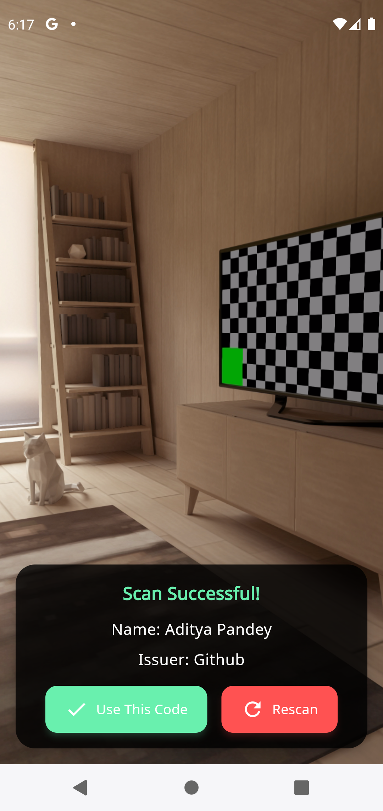

# TotpLock

TotpLock is a Flutter application for managing Time-based One-Time Passwords (TOTP). It allows users to add, view, and manage their TOTP accounts securely.

## Repository
[GitHub Repository](https://github.com/adityapandey217/totplock.git)

## Features
- Add TOTP accounts manually or by scanning QR codes.
- View and manage TOTP accounts.
- Copy TOTP codes to clipboard.
- Light and Dark theme support.

## Getting Started

### Prerequisites
- Flutter SDK: [Install Flutter](https://flutter.dev/docs/get-started/install)
- Dart SDK: Comes with Flutter installation.

### Installation
1. Clone the repository:
    ```sh
    git clone https://github.com/adityapandey217/totplock.git
    ```
2. Navigate to the project directory:
    ```sh
    cd totplock
    ```
3. Install dependencies:
    ```sh
    flutter pub get
    ```

### Running the App
1. Connect your device or start an emulator.
2. Run the app:
    ```sh
    flutter run
    ```

## Usage
- **Add Account**: Navigate to the setup screen and enter account details manually or scan a QR code.
- **View Accounts**: View the list of added TOTP accounts on the home screen.
- **Copy Code**: Tap on an account to copy the TOTP code to the clipboard.
- **Toggle Theme**: Use the theme toggle button in the app bar to switch between light and dark themes.

## Play Store
Download the app from the Google Play Store: [TotpLock](https://play.google.com/store/apps/details?id=com.afelion.totplock)

## Screenshots





## Contributing
Contributions are welcome! Please fork the repository and create a pull request with your changes.

## Contact
For any inquiries or issues, please contact [Aditya Pandey](https://aditya-pandey.com.np).
